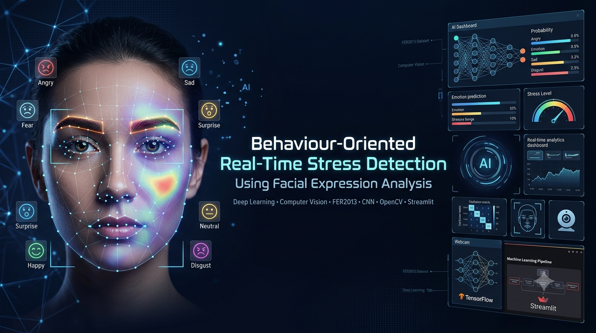

<p align="center">
  
</p>

<h1 align="center">🧠 Behaviour-Oriented Real-Time Stress Detection Using Facial Expression Analysis</h1>

<p align="center">
An AI-powered system that estimates stress levels from facial expressions using Deep Learning and Computer Vision.
</p>

<p align="center">
  
  
  
  
  
  
</p>

---

# 📖 Overview

Stress significantly influences human behavior, emotional well-being, and decision-making. Traditional stress assessment techniques often rely on physiological sensors, making them expensive and intrusive.

This project presents a **real-time, vision-based stress detection system** that estimates stress levels using **facial expression analysis**. A Convolutional Neural Network (CNN) trained on the **FER2013 dataset** recognizes facial emotions, which are then mapped to stress levels based on established psychological associations.

The system supports both **real-time webcam analysis** and **offline dataset evaluation** through an interactive Streamlit interface.

---

# ✨ Features

- 🎭 Facial Emotion Recognition using CNN
- 📷 Real-Time Webcam Stress Detection
- 📁 Dataset-Based Evaluation
- 📊 Stress Distribution Visualization
- 📈 Confusion Matrix Generation
- 🖥️ Interactive Streamlit Dashboard
- ⚡ Lightweight CPU Execution
- 🤖 AI-powered Behavioral Analysis

---

# 🏗️ System Architecture

```
               Webcam / FER2013 Dataset
                         │
                         ▼
                Face Detection (OpenCV)
                         │
                         ▼
              Image Preprocessing (48×48)
                         │
                         ▼
          CNN-based Emotion Classification
                         │
                         ▼
          Emotion-to-Stress Level Mapping
                         │
                         ▼
        Stress Prediction & Visualization
                         │
                         ▼
          Streamlit Dashboard / Webcam Output
```

---

# 🛠️ Technologies Used

| Category | Technologies |
|----------|--------------|
| Programming Language | Python |
| Deep Learning | TensorFlow, Keras |
| Computer Vision | OpenCV |
| Visualization | Matplotlib, Seaborn |
| Web Interface | Streamlit |
| Dataset | FER2013 |
| Scientific Computing | NumPy |

---

# 📂 Repository Structure

```
Behaviour-Oriented-Real-Time-Stress-Detection-Using-Facial-Expression-Analysis
│
├── code/
│   ├── app.py
│   ├── webcam_core.py
│   └── dataset_eval.py
│
├── dataset/
│   └── README.md
│
├── images/
│   └── banner.png
│
├── paper/
│   └── Research_Paper.pdf
│
├── presentation/
│   └── Project_Presentation.pptx
│
├── README.md
├── requirements.txt
├── LICENSE
└── .gitignore
```

---

# ⚙️ Workflow

1. Capture facial images from a webcam or the FER2013 dataset.
2. Detect faces using OpenCV Haar Cascade.
3. Convert images to grayscale and resize to **48 × 48 pixels**.
4. Classify facial emotions using a trained CNN model.
5. Map detected emotions to corresponding stress levels.
6. Display stress predictions through an interactive dashboard.

---

# 📊 Stress Mapping

| Emotion | Estimated Stress Level |
|----------|------------------------|
| Angry | High |
| Fear | High |
| Sad | Medium |
| Surprise | Medium |
| Disgust | Medium |
| Neutral | Low |
| Happy | Low |

---

# 📈 Results

The developed system successfully demonstrates:

- Real-time facial stress detection
- CNN-based emotion recognition
- Webcam-based live prediction
- Dataset evaluation
- Stress distribution visualization
- Confusion matrix generation

---

# 📚 Dataset

This project uses the **FER2013 (Facial Expression Recognition 2013)** dataset.

Dataset details are available inside:

```
dataset/README.md
```

---

# 📄 Research Paper

The complete IEEE-format research paper is included in:

```
paper/Research_Paper.pdf
```

---

# 🎞️ Presentation

Project presentation is available in:

```
presentation/Project_Presentation.pptx
```

---

# 🚀 Future Enhancements

- Vision Transformer (ViT) based emotion recognition
- LSTM-based temporal stress analysis
- Multimodal stress detection (Facial + Voice)
- Mobile application deployment
- Cloud-based stress monitoring dashboard
- Edge AI optimization for real-time inference

---

# 👨‍💻 Authors

- **Kavya Spoorthi**
- **B. Priyanka** (Guide)
- **Srilakshmi V**
- **G. Uday Kiran**

Department of CSE (Artificial Intelligence & Machine Learning)

B V Raju Institute of Technology

---

# ⭐ If you found this project useful

Please consider giving this repository a ⭐ to support the project.
